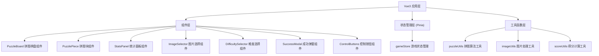

## 1. 架构设计



## 2. 技术描述

* **前端框架**: Vue\@3.4 + TypeScript + Vite

* **状态管理**: Pinia\@2

* **样式方案**: TailwindCSS\@3 + SCSS

* **动画库**: @vueuse/motion (Vue组合式动画)

* **工具库**: @vueuse/core (Vue组合式工具集)

* **初始化工具**: create-vite

* **后端**: 无 (纯前端应用)

* **数据存储**: LocalStorage (保存最佳成绩)

## 3. 目录结构

```
src/
├── components/
│   ├── PuzzleBoard.vue      # 拼图棋盘
│   ├── PuzzlePiece.vue      # 单个拼图块
│   ├── StatsPanel.vue       # 统计面板
│   ├── ImageSelector.vue    # 图片选择器
│   ├── DifficultySelector.vue # 难度选择器
│   ├── SuccessModal.vue     # 成功弹窗
│   └── ControlButtons.vue   # 控制按钮组
├── stores/
│   └── gameStore.ts         # 游戏状态管理
├── utils/
│   ├── puzzle.ts            # 拼图算法
│   ├── image.ts             # 图片处理
│   └── score.ts             # 得分计算
├── types/
│   └── index.ts             # 类型定义
├── assets/
│   └── images/              # 内置图片资源
├── App.vue
├── main.ts
└── style.css
```

## 4. 核心数据结构

```typescript
// 拼图块
interface PuzzlePiece {
  id: number;
  currentIndex: number;
  correctIndex: number;
  x: number;
  y: number;
  isEmpty: boolean;
}

// 游戏状态
interface GameState {
  difficulty: 3 | 4 | 5;
  pieces: PuzzlePiece[];
  moves: number;
  time: number;
  isPlaying: boolean;
  isCompleted: boolean;
  currentImage: string;
  bestScores: Record<string, number>;
}

// 难度配置
interface DifficultyConfig {
  size: 3 | 4 | 5;
  label: string;
  baseScore: number;
}

// 游戏结果
interface GameResult {
  moves: number;
  time: number;
  score: number;
  stars: number;
  difficulty: number;
}
```

## 5. 核心算法

### 5.1 拼图打乱算法

* 使用 Fisher-Yates 洗牌算法打乱拼图块

* 确保打乱后的拼图是可解的（检查逆序数奇偶性）

* 空白格固定在右下角

### 5.2 可解性判定

* 计算逆序数：统计每个拼图块前面比它大的块数之和

* 对于N×N的拼图：

  * N为奇数：逆序数必须为偶数

  * N为偶数：逆序数 + 空白格所在行（从底部数）必须为奇数

### 5.3 移动逻辑

* 点击拼图块时，检查其上下左右相邻位置

* 如果相邻位置是空白格，则交换位置

* 移动后检查是否完成拼图

### 5.4 完成判定

* 遍历所有拼图块，检查 currentIndex === correctIndex

* 全部满足则判定为完成

### 5.5 得分计算

```
基础分 = 难度系数 × 1000
时间惩罚 = 用时秒数 × 2
步数惩罚 = 移动步数 × 1
最终得分 = max(0, 基础分 - 时间惩罚 - 步数惩罚)
星级 = 根据得分占基础分的比例判定 (≥90%: 3星, ≥70%: 2星, ≥50%: 1星)
```

## 6. 状态管理设计

### gameStore Actions

* `initGame(difficulty, image)`: 初始化游戏

* `shufflePuzzle()`: 打乱拼图

* `movePiece(pieceId)`: 移动拼图块

* `resetPuzzle()`: 重置到初始打乱状态

* `restartGame()`: 重新开始当前游戏

* `changeImage(image)`: 更换图片

* `changeDifficulty(size)`: 改变难度

* `checkCompletion()`: 检查是否完成

### gameStore Getters

* `emptyPiece`: 获取空白块

* `movablePieces`: 获取可移动的拼图块

* `isSolvable`: 拼图是否可解

* `formattedTime`: 格式化的时间显示

```typescript
// 难度配置
const DIFFICULTIES: DifficultyConfig[] = [
  { size: 3, label: '简单 3×3', baseScore: 1000 },
  { size: 4, label: '中等 4×4', baseScore: 2000 },
  { size: 5, label: '困难 5×5', baseScore: 3500 },
];
```

