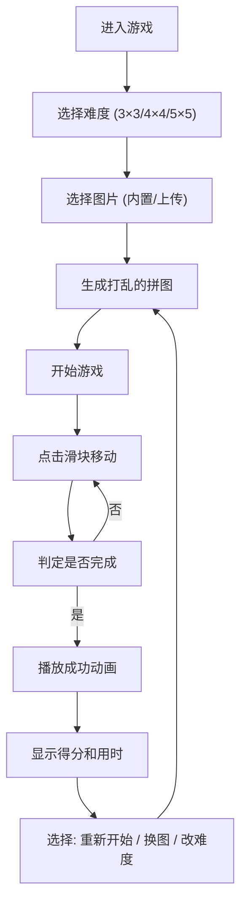

## 1. 产品概述
图片滑块拼图游戏是一款基于Vue3开发的休闲益智游戏，用户可以通过滑动打乱的图片碎片来还原完整图片。支持自定义图片上传、多种难度选择，提供计时和步数统计功能。

- 主要用途：休闲娱乐、脑力锻炼
- 目标用户：喜欢益智游戏的各类人群
- 产品价值：提供轻松有趣的拼图体验，支持个性化图片素材

## 2. 核心功能

### 2.1 功能模块

1. **游戏主界面**：拼图棋盘、原图参考、统计信息
2. **难度选择**：3×3、4×4、5×5 三种规格
3. **图片管理**：内置图库选择、本地图片上传
4. **游戏控制**：重置、换图、重新开始
5. **成功反馈**：完成动画、得分展示

### 2.2 页面详情

| 页面名称 | 模块名称 | 功能描述 |
|-----------|-------------|---------------------|
| 游戏主界面 | 拼图棋盘 | 显示打乱的拼图块，支持点击移动，带有滑动动画 |
| 游戏主界面 | 原图参考 | 显示完整的参考图片，可展开/收起 |
| 游戏主界面 | 统计面板 | 实时显示步数、用时、难度等级 |
| 游戏主界面 | 控制按钮 | 重新开始、重置、换图操作 |
| 图片选择弹窗 | 内置图库 | 提供多款精美内置图片供选择 |
| 图片选择弹窗 | 本地上传 | 支持用户上传本地图片作为拼图素材 |
| 难度选择器 | 难度切换 | 3×3/4×4/5×5 三种难度快速切换 |
| 成功弹窗 | 完成动画 | 庆祝动画、得分计算、用时统计 |

## 3. 核心流程

## 4. 用户界面设计

### 4.1 设计风格

- **主色调**：采用清新明快的渐变色彩，蓝紫色系作为主色，搭配暖橙色作为强调色
- **按钮风格**：圆角卡片式按钮，带有柔和阴影和悬停动效
- **字体**：使用现代无衬线字体，标题醒目，数字统计区域使用等宽字体
- **布局风格**：居中卡片式布局，拼图区域为视觉焦点，控制区域环绕四周
- **动效风格**：滑块移动使用平滑过渡动画，成功时使用弹性缩放+彩色粒子效果

### 4.2 页面设计概述

| 页面名称 | 模块名称 | UI元素 |
|-----------|-------------|-------------|
| 游戏主界面 | 拼图棋盘 | 正方形网格布局，滑块带有边框和轻微阴影，移动时有过渡动画 |
| 游戏主界面 | 原图参考 | 右上角缩略图，悬停放大，点击可切换显示/隐藏 |
| 游戏主界面 | 统计面板 | 顶部横向排列，步数、时间、难度标签，数字使用渐变色彩 |
| 图片选择弹窗 | 内置图库 | 网格布局展示缩略图，选中状态有边框高亮 |
| 图片选择弹窗 | 本地上传 | 拖拽上传区域，带有虚线边框和上传图标 |
| 成功弹窗 | 完成动画 | 全屏半透明遮罩，中心卡片带缩放动画，彩色粒子背景 |

### 4.3 响应式

- 桌面端优先设计，拼图区域自适应屏幕大小
- 移动端适配：控制按钮移至底部，原图参考改为可折叠面板
- 触摸设备优化：增大点击区域，支持触摸滑动操作

### 4.4 视觉细节

- 背景：使用柔和的渐变背景搭配轻微的网格纹理
- 拼图块：图片边缘添加内阴影增强立体感，选中时轻微放大
- 空白格：使用半透明占位，带有脉动动画提示可移动
- 得分计算：根据难度和用时动态计算，星级评价系统
